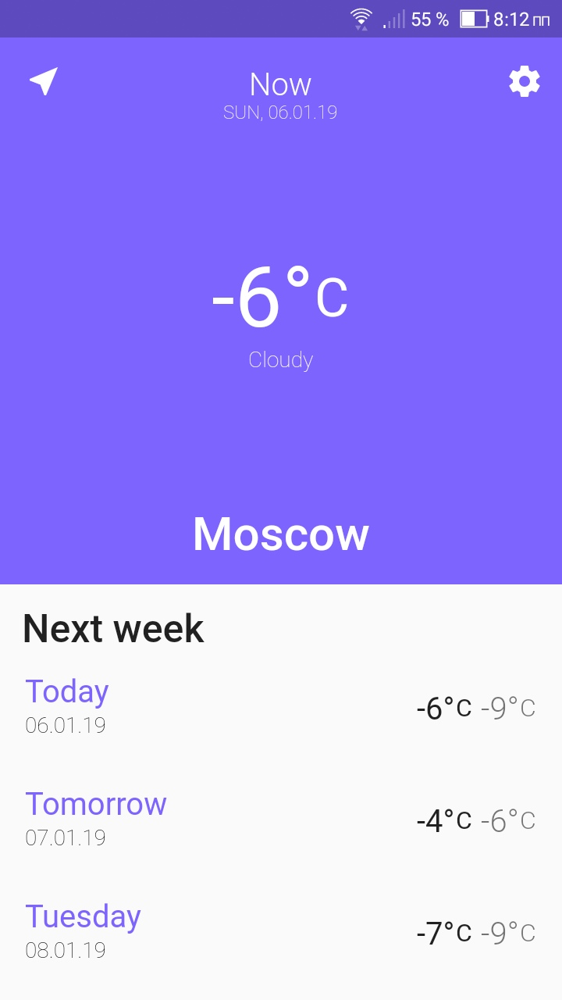
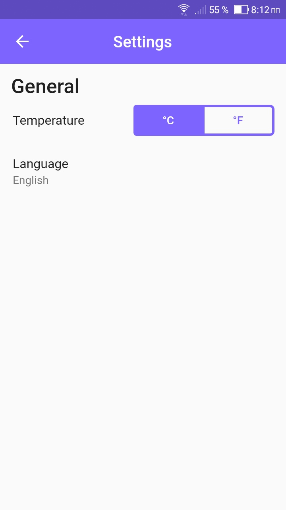

# Weather

Simple weather app, written in flutter

  

## Installation

1. Clone repository

    `git clone https://github.com/mk101/flutter_weather.git`

2. Get dependency 
```
    cd flutter_weather
    flutter packages get
```
3. Run app

    `flutter run`